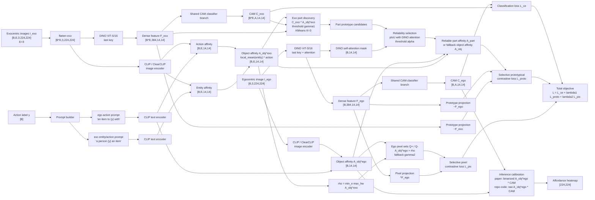
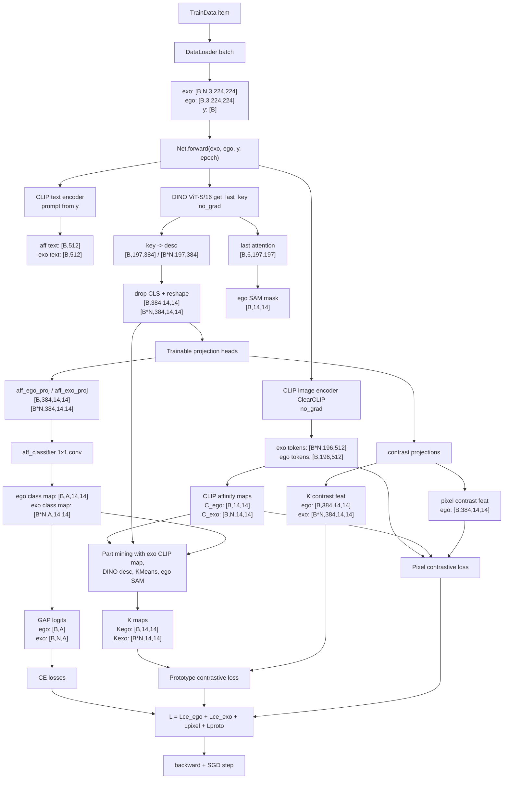
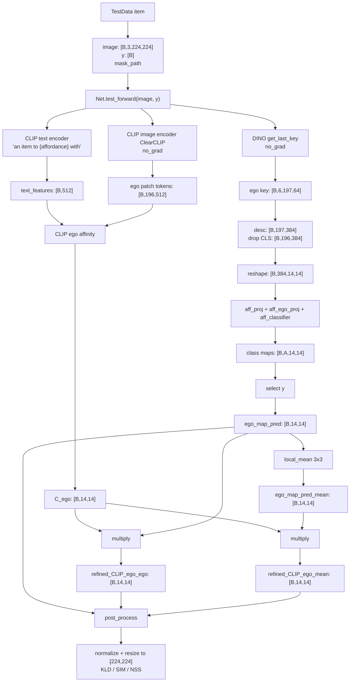

# SelectiveCL Train / Inference Flow Analysis

이 문서는 `train.py`, `test.py`, `models/locate.py`, `data/*`, `loss/loss.py`의 실제 구현을 기준으로 SelectiveCL의 학습 및 추론 흐름을 정리한다. 논문 용어보다 코드에서 실제로 어떤 tensor가 어떤 모듈을 통과하는지를 우선한다.

## 1. 핵심 표기

| Symbol | Meaning | Default / code value |
| --- | --- | --- |
| `B` | batch size | train default `8`, test default `1` |
| `N` | exocentric images per sample | fixed `3` in `TrainData` |
| `A` | affordance class count | Seen `36`, Unseen `25`, HICO train `10` |
| `S` | input crop size | `224` |
| `P` | ViT patch size | `16` |
| `H`, `W` | patch grid size | `224 / 16 = 14` |
| `HW` | number of patch tokens | `196` |
| `D_dino` | DINO ViT-S/16 feature dim | `384` |
| `D_clip` | CLIP ViT-B/16 output dim | `512` |
| `K` | KMeans cluster count | `3` |

Important implementation constants:

- DINO backbone: `vits.vit_small(patch_size=16, num_classes=0)`
- CLIP backbone: `create_model('ViT-B/16', pretrained='openai')`
- Input image transform:
  - train: resize `256`, random crop `224`, random horizontal flip, ImageNet normalization
  - test: resize directly to `224 x 224`, ImageNet normalization

## 2. File Map

| File | Role |
| --- | --- |
| `run.sh` | Minimal train commands for Seen and Unseen |
| `run_selectivecl_all_gpu3.sh` | Full run orchestration: env setup, checkpoint download, train Seen/Unseen, test official checkpoints |
| `run_selectivecl_visualize_gpu3.sh` | Qualitative visualization inference with official checkpoints |
| `train.py` | Training entrypoint and epoch-end evaluation |
| `test.py` | Checkpoint inference / metric / optional visualization entrypoint |
| `data/datatrain.py` | Builds `(exocentric_images, egocentric_image, aff_label, aff_name)` |
| `data/datatest.py` | Builds `(image, label, mask_path)` |
| `models/locate.py` | Main `Net`, train `forward`, inference `test_forward` |
| `loss/loss.py` | Pixel contrastive and prototype contrastive losses |
| `utils/util.py` | seed, GT cache, map normalization, optimizer |
| `utils/evaluation.py` | KLD, SIM, NSS, classification accuracy |

## 2.1 Core Code: What Matters Most

내가 봤을 때 이 repo의 핵심 코드는 `models/locate.py`의 `Net.forward()`와 `Net.test_forward()`다. 이유는 논문 방법론의 대부분이 여기에서 실제 tensor operation으로 구현되기 때문이다.

| Priority | Code | Why it is core |
| --- | --- | --- |
| 1 | `models/locate.py::Net.forward` | train-time CLIP affinity, DINO descriptor, KMeans part mining, CAM logits, pixel/prototype contrastive loss input을 모두 조립한다. 논문 방법론의 중심 구현이다. |
| 2 | `loss/loss.py::ContrastiveLoss` | selective prototypical contrastive learning의 실제 비교 대상, positive/negative/ignore mask를 정의한다. |
| 3 | `loss/loss.py::PixelContrastiveLoss` | 논문상 pixel contrastive를 구현하지만 실제 단위는 raw pixel이 아니라 `14 x 14` patch feature다. |
| 4 | `models/locate.py::Net.test_forward` | inference-time CAM 생성과 CLIP refinement를 수행한다. exocentric branch와 KMeans는 inference에서 빠진다. |
| 5 | `data/datatrain.py::TrainData.__getitem__` | exo 3장 + ego 1장 + affordance label이라는 training sample 구조를 만든다. |
| 6 | `train.py` main loop | loss summation, optimizer step, epoch-end GT evaluation, best checkpoint save policy를 결정한다. |
| 7 | `test.py` main loop | checkpoint inference, optional visualization, KLD/SIM/NSS reporting을 담당한다. |

Short dependency view:

```text
data/datatrain.py
  -> train.py
    -> models/locate.py::Net.forward
      -> CLIP / DINO feature extraction
      -> KMeans part mining
      -> loss/loss.py::{ContrastiveLoss, PixelContrastiveLoss}
    -> epoch-end models/locate.py::Net.test_forward
    -> utils/evaluation.py metrics with GT masks

 test.py
  -> data/datatest.py
  -> models/locate.py::Net.test_forward
  -> utils/evaluation.py metrics with GT masks
```

Important distinction:

```text
training loss does not use GT heatmaps/masks
GT masks are used only for epoch-end evaluation and final test metrics
```

## 2.1 Paper-aligned Architecture Diagram

아래 구조도는 논문 Fig. 2-5의 관점에 맞춘 전체 구조다. 이후 섹션의 tensor-flow diagram은 이 구조를 실제 코드 변수와 shape로 풀어쓴 것이다.



### Structure Explanation

| Block | Paper role | Repo implementation |
| --- | --- | --- |
| CLIP / ClearCLIP object discovery | Generates object affinity maps `A_obj^ego`, `A_obj^exo` from action/entity prompts | `get_clip_affinity_map`, `get_clip_affinity_map_ego` |
| DINO dense features | Provides spatial descriptors `F_ego`, `F_exo` and DINO attention for part reliability | `vit_model.get_last_key` |
| CAM classifier branch | Shared classifier captures semantic affordance information across ego/exo views | `aff_proj -> aff_ego_proj/aff_exo_proj -> aff_classifier` |
| Exo part discovery | Uses `C_exo * A_obj^exo`, threshold `gamma1`, KMeans `K=3`, DINO-attn pIoU threshold `alpha` | KMeans loop in `Net.forward` |
| Selective prototypical CL | Pulls ego anchor toward part prototype if reliable, otherwise toward object prototype; contrasts against backgrounds / other classes | `ContrastiveLoss` |
| Selective pixel CL | Splits ego pixels into `Q+`, `Q-` using exo-derived `rho`, fallback `gamma2`; contrasts ego pixels | `PixelContrastiveLoss` |
| Inference calibration | Paper says binarized `A_obj^ego * CAM`; repo code multiplies raw CLIP similarity with CAM and also reports local-mean variant | `Net.test_forward` |

### Paper vs Code Alignment Notes

The structure above is paper-aligned, but three implementation details are code-specific:

1. The paper writes the final objective as `L = L_ce + lambda1 L_proto + lambda2 L_pix`; the repo uses direct summation, equivalent to default `lambda1=lambda2=1`.
2. The paper describes inference calibration with a binarized object affinity map. The repo's `test_forward` uses raw `CLIP_ego_similarity * CAM`.
3. The paper's prototype negative uses `beta - M * C`; the repo effectively implements the common case as `1 - positive_map`.

## 2.2 Paper Figures for Quick Understanding

논문 source tarball `arXiv-2508.07877v1.tar.gz`에서 본문 figure를 추출해 `assets/paper_figures/`에 PNG로 렌더링했다. 아래 그림들은 논문 구조를 빠르게 이해하기 위한 reference이고, 이후 섹션의 tensor-flow와 수식 설명은 repo 구현 기준으로 더 세분화한 것이다.

### Figure 2: Motivation and Selective Learning Intuition


이 그림은 SelectiveCL의 핵심 동기를 보여준다. part-level clue가 신뢰 가능하면 affordance-relevant part를 학습하고, 신뢰하기 어렵다면 object-level clue를 사용해 background나 affordance-irrelevant part로 attention이 흐르는 것을 막는다.

### Figure 3: Overall Framework


전체 구조는 DINO feature branch, shared CAM classifier branch, CLIP object affinity branch, contrastive learning branch로 나뉜다. 코드 기준으로는 이 그림의 DINO feature가 `vit_model.get_last_key`, CAM branch가 `aff_proj -> aff_ego_proj/aff_exo_proj -> aff_classifier`, contrastive branch가 `K_contrast_projection`과 `pixel_contrast_projection`에 대응한다.

### Figure 4: Object Discovery with CLIP / ClearCLIP


CLIP/ClearCLIP은 action prompt와 image patch feature의 similarity로 object affinity map을 만든다. egocentric map은 action prompt만 사용하고, exocentric map은 action-prompted map과 entity-prompted map을 곱해서 더 interaction-related object region에 집중한다.

### Figure 5: Selective Prototypical Contrastive Learning


이 그림은 exocentric image에서 part prototype candidate를 찾고, DINO attention 기반 pIoU로 reliable part인지 판단하는 과정을 보여준다. reliable part가 있으면 part-level prototype을 positive target으로 쓰고, 없으면 object-level prototype으로 fallback한다.

### Figure 6: Selective Pixel Contrastive Learning


Pixel contrastive learning은 exocentric object affinity map의 salient response를 기준값 `rho`로 사용해 egocentric pixel을 `Q+`와 `Q-`로 나눈다. 코드에서는 이 아이디어가 `PixelContrastiveLoss` 안에서 ego pixel feature 간 contrastive objective로 구현된다.

### Figure 7: Discovered Object / Part Examples


학습 guidance가 실제로 어떤 영역을 선택하는지 보여주는 qualitative 예시다. 왼쪽은 CLIP object affinity, 가운데는 prototypical contrastive learning에 쓰이는 exocentric part clue, 오른쪽은 pixel contrastive learning에 쓰이는 egocentric positive pixel clue에 대응한다.

## 3. Training Flow Overview

Entrypoint:

```bash
python train.py --divide Seen
python train.py --divide Unseen
```

`train.py` also supports `--divide HICO`, but HICO paths are special-cased and the current `test.py` is AGD20K Seen/Unseen oriented.

### 3.1 Visual Module Flow



### 3.2 Dataset Output

`TrainData.__getitem__` starts from one exocentric image path:

```text
{data_root}/{divide}/trainset/exocentric/{affordance}/{object}/{image}
```

It then:

1. extracts `aff_name` and `object` from the path,
2. maps `aff_name` to integer label `y`,
3. randomly samples one egocentric image from:

```text
{data_root}/{divide}/trainset/egocentric/{affordance}/{object}
```

4. builds `N = 3` exocentric images from the same exocentric directory.

Returned sample:

| Tensor / value | Shape | Meaning |
| --- | --- | --- |
| `exocentric_images` | `[N, 3, 224, 224]` | 3 third-person examples |
| `egocentric_image` | `[3, 224, 224]` | 1 object-focused target image |
| `aff_label` | scalar int | affordance class index |
| `aff_name` | string | affordance name |

After DataLoader batching:

| Tensor / value | Shape |
| --- | --- |
| `exo` | `[B, N, 3, 224, 224]` |
| `ego` | `[B, 3, 224, 224]` |
| `aff_label` | `[B]` |

Inside `Net.forward`, `exo` is flattened:

```python
exo = exo.flatten(0, 1)
```

So:

```text
[B, N, 3, 224, 224] -> [B*N, 3, 224, 224]
```

### 3.3 Text Prompt Encoding

The affordance label is converted to CLIP text prompts in `organize_classnames`.

For egocentric affordance localization:

```text
"an item to {affordance} with"
```

For exocentric object/action matching:

```text
"a person {affordance} an item"
```

Token and text feature shapes:

| Variable | Shape | Code use |
| --- | --- | --- |
| `aff_classnames` | `[B, 77]` | CLIP tokens |
| `text_features` | `[B, 512]` | ego affordance text embedding |
| `exo_aff_classnames` | `[B, 77]` | CLIP tokens |
| `exo_text_features` | `[B, 512]` | exo action/object text embedding |

### 3.4 CLIP Image Affinity Maps

CLIP visual encoder call:

```python
_, exo_image_features, _ = self.net.encode_image(exo, model_type='ClearCLIP', ignore_residual=True)
_, ego_image_features, _ = self.net.encode_image(ego, model_type='ClearCLIP', ignore_residual=True)
```

The code uses patch tokens, not the pooled image feature:

| Variable | Shape |
| --- | --- |
| `exo_image_features` | `[B*N, 196, 512]` |
| `ego_image_features` | `[B, 196, 512]` |
| `text_features` | `[B, 512]` |
| `exo_text_features` | `[B, 512]` |

All features are L2-normalized before dot products.

Egocentric CLIP similarity:

```math
C^{ego}_{b,p} =
\left< \frac{f^{ego}_{b,p}}{\|f^{ego}_{b,p}\|_2},
        \frac{t^{aff}_{b}}{\|t^{aff}_{b}\|_2} \right>
```

Then reshaped:

```text
[B, 196] -> [B, 14, 14]
```

Exocentric CLIP similarity uses two text embeddings:

```math
C^{exo,obj}_{b,n,p} =
\left< \hat f^{exo}_{b,n,p}, \hat t^{exo}_{b} \right>
```

```math
C^{exo,aff}_{b,n,p} =
\left< \hat f^{exo}_{b,n,p}, \hat t^{aff}_{b} \right>
```

The code then computes:

```math
C^{exo}_{b,n} =
local\_mean(C^{exo,obj}_{b,n}) \odot C^{exo,aff}_{b,n}
```

Shape:

```text
C_ego: [B, 14, 14]
C_exo: [B, N, 14, 14]
```

### 3.5 DINO Descriptor and Attention Flow

DINO call:

```python
_, ego_key, ego_attn = self.vit_model.get_last_key(ego)
_, exo_key, _ = self.vit_model.get_last_key(exo)
```

DINO ViT-S/16 has:

```text
num_heads = 6
head_dim = 384 / 6 = 64
tokens = 1 CLS + 196 patches = 197
```

Raw key shape:

```text
ego_key: [B, 6, 197, 64]
exo_key: [B*N, 6, 197, 64]
```

The code converts per-head keys to a 384-dimensional descriptor:

```python
ego_desc = ego_key.permute(0, 2, 3, 1).flatten(-2, -1)
```

Shape:

```text
[B, 6, 197, 64]
-> permute [B, 197, 64, 6]
-> flatten [B, 197, 384]
```

Then it drops the CLS token and reshapes patch tokens to a feature map:

```text
ego_desc[:, 1:] : [B, 196, 384]
_reshape_transform -> [B, 384, 14, 14]

exo_desc[:, 1:] : [B*N, 196, 384]
_reshape_transform -> [B*N, 384, 14, 14]
```

DINO attention is also used to make an egocentric self-attention mask:

```python
ego_cls_attn = ego_attn[:, :, 0, 1:].reshape(B, 6, 14, 14)
ego_cls_attn = (ego_cls_attn > mean_per_head).float()
ego_sam = ego_cls_attn[:, [0, 1, 3]].mean(1)
ego_sam = normalize_minmax(ego_sam)
sam_hard = ego_sam > mean(ego_sam)
```

Shape:

```text
ego_attn: [B, 6, 197, 197]
CLS-to-patch attention: [B, 6, 196]
ego_sam: [B, 14, 14]
sam_hard: [B, 196]
```

### 3.6 Trainable Heads and Classifier

The trainable parts consume DINO descriptors.

Projection MLP:

```text
aff_proj: LayerNorm(384) -> Linear(384,1536) -> GELU -> Linear(1536,384)
```

Shape:

```text
[B, 196, 384] -> [B, 196, 384] -> [B, 384, 14, 14]
[B*N, 196, 384] -> [B*N, 196, 384] -> [B*N, 384, 14, 14]
```

Convolutional heads:

```text
aff_ego_proj: Conv3x3 384->384 -> BN -> ReLU -> Conv3x3 384->384 -> BN -> ReLU
aff_exo_proj: same structure
aff_classifier: Conv1x1 384->A
K_contrast_projection: Conv1x1 384->384
pixel_contrast_projection: Conv1x1 384->384
```

Classifier outputs:

| Variable | Shape |
| --- | --- |
| `ego_pred` | `[B, A, 14, 14]` |
| `aff_logits_ego = GAP(ego_pred)` | `[B, A]` |
| `exo_pred` | `[B*N, A, 14, 14]` |
| `aff_logits_exo` | `[B, N, A]` |

Class-specific maps are selected with labels:

```python
ego_pred_gt = ego_pred[batch_idx, aff_label]
exo_pred_gt = exo_pred[batch_exo_idx, repeated_aff_label]
```

Shapes:

```text
ego_pred_gt: [B, 14, 14]
exo_pred_gt: [B*N, 14, 14] -> conceptually [B, N, 14, 14]
```

### 3.7 Cross-view Part Mining

The part mining block builds pseudo part maps from exocentric images and transfers them to the egocentric image.

Epoch-dependent exocentric mining mask:

```python
if epoch != 0:
    exo_mask_gt = relu(CLIP_exo_similarity) * relu(exo_pred_gt)
else:
    exo_mask_gt = CLIP_exo_similarity
```

In math:

```math
M^{exo}_{b,n,p} =
\begin{cases}
C^{exo}_{b,n,p}, & epoch = 0 \\
\max(C^{exo}_{b,n,p}, 0)\max(S^{exo}_{b,n,p}, 0), & epoch > 0
\end{cases}
```

where `S_exo` is the label-selected classifier map.

For each sample `b`:

1. Normalize each exocentric CAM to `[0, 1]`.
2. Select descriptors whose normalized CAM is above `gamma1`.

```math
P_{b,n} = \{p \mid \tilde M^{exo}_{b,n,p} > \gamma_1\}
```

3. Concatenate selected exocentric DINO descriptors across `N = 3` exo images.
4. Run KMeans with `K = 3`.

Fallback condition:

```text
if selected_descriptor_count < K:
    use raw CLIP maps
```

For each centroid `c_k`, the code computes:

```math
R^{exo}_{n,k,p} =
\left< \hat c_k, \widehat{d^{exo}_{n,p}} \right>
```

For ego, descriptors are first weighted by CLIP ego similarity:

```python
ego_desc_flat = (ego_desc * CLIP_ego_similarity.unsqueeze(1)).flatten(-2, -1)
```

Then:

```math
R^{ego}_{k,p} =
\left< \hat c_k, \widehat{C^{ego}_{p} d^{ego}_{p}} \right>
```

Cluster selection uses overlap with DINO self-attention hard mask:

```math
H_k = \mathbf{1}[\tilde R^{ego}_{k,p} > mean_p(\tilde R^{ego}_{k,p})]
```

```math
p\_score_k =
\frac{1}{2}
\left(
\frac{|H_k \cap SAM|}{|H_k|}
+
\frac{|SAM|}{|H_k \cup SAM|}
\right)
```

If:

```text
max_k p_score_k < alpha
```

the implementation falls back to raw CLIP maps.

Otherwise:

```text
target_cluster = argmax_k p_score_k
```

Two maps are built for the selected cluster:

1. cosine-similarity map from centroid to descriptors,
2. softmax over negative Euclidean distance to centroid.

The final mined probability map is their average:

```math
K^{ego} = \frac{R^{ego}_{target} + softmax(-dist(d^{ego}, c_{target}))}{2}
```

```math
K^{exo} = \frac{R^{exo}_{target} + softmax(-dist(d^{exo}, c_{target}))}{2}
```

Shapes:

| Variable | Shape |
| --- | --- |
| `CLIP_ego_similarity_kmeans_prob` | `[B, 14, 14]` |
| `CLIP_exo_similarity_kmeans_prob` | `[B*N, 14, 14]` |
| `Kego_mask_gt` | `[B, 14, 14]` |
| `Kexo_mask_gt` | `[B*N, 14, 14]` |

Epoch-dependent contrastive positive maps:

```math
K^{ego}_{pos} =
\begin{cases}
K^{ego}, & epoch = 0 \\
K^{ego} \odot S^{ego}, & epoch > 0
\end{cases}
```

```math
K^{exo}_{pos} =
\begin{cases}
K^{exo}, & epoch = 0 \\
K^{exo} \odot S^{exo}, & epoch > 0
\end{cases}
```

Background maps:

```math
K^{ego}_{bg} = 1 - K^{ego}_{pos}
```

```math
K^{exo}_{bg} = 1 - K^{exo}_{pos}
```

### 3.8 Loss Implementation

Total loss in `train.py`:

```python
loss = loss_ce_ego + loss_ce_exo + loss_pixelcont + loss_protocont
```

#### 3.8.1 Ego / Exo Classification CE

Ego classification:

```math
z^{ego}_{b,a} = GAP(S^{ego}_{b,a,:,:})
```

```math
L^{ego}_{CE} = CE(z^{ego}, y)
```

Exo classification:

```math
z^{exo}_{b,n,a} = GAP(S^{exo}_{b,n,a,:,:})
```

```math
L^{exo}_{CE} =
\frac{1}{3}\sum_{n=1}^{3} CE(z^{exo}_{:,n,:}, y)
```

Note: the code divides by the literal value `3`, matching `TrainData`'s fixed `num_exo = 3`.

#### 3.8.2 PixelContrastiveLoss

Inputs:

| Input | Shape |
| --- | --- |
| `contfeat_ego` | `[B, 384, 14, 14]` |
| `weight_map` | `[B, 14, 14]` |
| `text_features` | `[B, 512]` |
| `ego_image_features` | `[B, 196, 512]` |
| `exo_image_features` | `[B*N, 196, 512]` |

The code first computes CLIP-based exo and ego similarity to text:

```math
E^{exo}_{b,n,p} =
\left< \hat f^{exo}_{b,n,p}, \hat t_b \right>
```

```math
E^{ego}_{b,p} =
\left< \hat f^{ego}_{b,p}, \hat t_b \right>
```

It takes each exo image's maximum similarity and then the minimum across the `N` exo images:

```math
\tau_b = \min_n \max_p E^{exo}_{b,n,p}
```

Foreground pixel label:

```math
g_{b,p} = \mathbf{1}[\tau_b < E^{ego}_{b,p}]
```

If a sample has no foreground pixels, the code uses `weight_map` as fallback foreground labels.

The ego pixel features are L2-normalized:

```text
[B,384,14,14] -> [B,196,384]
```

For each sample, it builds a pixel-pixel logit matrix:

```math
\ell_{p,q} = \frac{\hat z_p^\top \hat z_q}{T}
```

Self-pairs are removed from the denominator.

Positive pair mask:

```math
M_{p,q} = \mathbf{1}[g_p = g_q] \cdot \mathbf{1}[p \ne q]
```

Log probability:

```math
\log P(p,q) =
\ell_{p,q} -
\log \sum_{r \ne p}\exp(\ell_{p,r})
```

Mean positive log probability for anchor `p`:

```math
\bar l_p =
\frac{\sum_q M_{p,q}\log P(p,q)}
     {\sum_q M_{p,q}}
```

The implementation then keeps only anchors where `weight_map > 0.5` and averages:

```math
L_{pixel} =
-\frac{T}{T_{base}}
mean_{p: weight(p)>0.5}(\bar l_p)
```

#### 3.8.3 Prototype Contrastive Loss

Inputs:

| Input | Shape |
| --- | --- |
| `ego_pred_Kcontrast` | `[B, 384, 14, 14]` |
| `exo_pred_Kcontrast` | `[B*N, 384, 14, 14]` |
| `ego_similarity` | `[B, 14, 14]` |
| `exo_similarity` | `[B*N, 14, 14]` |
| `ego_bg_similarity` | `[B, 14, 14]` |
| `exo_bg_similarity` | `[B*N, 14, 14]` |
| `aff_label` | `[B]` |

Prototype builder:

```python
proto = torch.mean(feat_map * similarity_map.unsqueeze(1), dim=(2, 3))
proto = F.normalize(proto, dim=1)
```

Math:

```math
p(F, M) =
normalize_2
\left(
\frac{1}{HW}\sum_x F_x M_x
\right)
```

The code builds four prototype sets:

```text
ego_proto_pos: [B,384]
ego_proto_neg: [B,384]
exo_proto_pos: [B*N,384]
exo_proto_neg: [B*N,384]
```

Then concatenates:

```text
feat_whole: [2B + 2BN, 384]
```

Anchor:

```math
a_b =
normalize_2
\left(
\frac{1}{HW}\sum_x F^{ego}_{b,x} O^{ego}_{b,x}
\right)
```

`O_ego` is `CLIP_ego_similarity` only for samples whose part mining succeeded; otherwise it is all ones.

The positive mask uses same affordance labels for:

1. ego positive prototypes,
2. exo positive prototypes.

Background prototypes with the same affordance are placed into an ignore mask rather than used as positives.

InfoNCE-style logit:

```math
\ell_{b,j} = \frac{a_b^\top p_j}{T}
```

Loss:

```math
L_{proto} =
-\frac{T}{T_{base}}
mean_b
\left(
\frac{\sum_j M^+_{b,j}\log P_{b,j}}
     {\sum_j M^+_{b,j}}
\right)
```

where the denominator of `P` excludes ignored entries via the implementation's `neglect_logits_mask`.

### 3.9 Epoch-end Evaluation During Training

After each train epoch, `train.py` switches to eval mode and runs the test set:

```python
ego_pred, refined_CLIP_ego_ego, refined_CLIP_ego_mean = model.test_forward(image, label)
```

It computes metrics for all three outputs:

| Output | Meaning |
| --- | --- |
| `ego_pred` | raw class-specific model activation |
| `refined_CLIP_ego_ego` | CLIP ego similarity multiplied by raw activation |
| `refined_CLIP_ego_mean` | CLIP ego similarity multiplied by local-mean activation |

The checkpoint save criterion is:

```text
save model only when refined_CLIP_ego_ego has the best KLD so far
```

Saved filename:

```text
best_model_{epoch}_{mKLD}_{mSIM}_{mNSS}.pth
```

### 3.10 Does Training Use GT Masks?

Train loss 계산에는 GT heatmap/mask가 사용되지 않는다. 이 repo는 weakly supervised affordance grounding 구현이므로 gradient를 만드는 supervision은 다음 항목들이다.

| Source | Used in train loss? | Purpose |
| --- | --- | --- |
| image-level affordance label `aff_label` | yes | CE loss와 contrastive class relation 구성 |
| egocentric image | yes | target image feature, CAM, pixel/prototype contrastive anchor |
| exocentric images | yes | contextual hints, exo part prototype discovery |
| CLIP object affinity | yes | pseudo object/part clue generation |
| DINO descriptor / attention | yes | patch feature, KMeans prototype, reliable part selection |
| GT heatmap/mask | no | train loss에는 들어가지 않음 |

However, `train.py` does use GT masks after each epoch for evaluation:

```text
train mini-batch step:
  prediction vs pseudo clues / labels
  -> loss
  -> backward
  -> optimizer.step
  -> no GT mask

end of epoch:
  model.test_forward(test image, label)
  prediction heatmap vs GT mask
  -> KLD / SIM / NSS
  -> best checkpoint selection
```

따라서 정확한 표현은 다음과 같다.

```text
The training objective is weakly supervised and does not use dense GT masks.
The training script still reads GT masks for validation-style metric computation after each epoch.
```

## 4. Inference Flow Overview

Entrypoint:

```bash
python test.py --model_file [checkpoint.pth] --divide Seen
python test.py --model_file [checkpoint.pth] --divide Unseen
```

Visualization:

```bash
python test.py \
  --model_file checkpoints/agd20k_seen.pth \
  --divide Seen \
  --save_visuals \
  --save_heatmaps \
  --save_path visual_runs/example
```

### 4.1 Visual Module Flow



### 4.2 Test Dataset Output

`TestData` scans:

```text
{data_root}/{divide}/testset/egocentric/{affordance}/{object}/{image}
```

It only keeps an image if the corresponding GT mask exists:

```text
{data_root}/{divide}/testset/GT/{affordance}/{object}/{image_stem}.png
```

Returned sample:

| Tensor / value | Shape | Meaning |
| --- | --- | --- |
| `image` | `[3, 224, 224]` | egocentric test image |
| `label` | scalar int | affordance class index |
| `mask_path` | string | GT mask path |

After DataLoader batching:

| Tensor / value | Shape |
| --- | --- |
| `image` | `[B, 3, 224, 224]` |
| `label` | `[B]` |
| `mask_path` | list-like path batch |

### 4.3 `test_forward` Tensor Flow

The inference function intentionally does not use exocentric images, KMeans mining, pixel contrastive loss, or prototype contrastive loss.

Text:

```text
label [B]
-> prompt tokens [B,77]
-> text_features [B,512]
```

CLIP:

```text
ego image [B,3,224,224]
-> CLIP patch tokens [B,196,512]
-> dot(text_features) [B,196]
-> CLIP_ego_similarity [B,14,14]
```

DINO + classifier:

```text
ego image [B,3,224,224]
-> DINO key [B,6,197,64]
-> descriptor [B,197,384]
-> drop CLS [B,196,384]
-> aff_proj [B,196,384]
-> reshape [B,384,14,14]
-> aff_ego_proj [B,384,14,14]
-> aff_classifier [B,A,14,14]
-> select label y [B,14,14]
```

Returned maps:

```python
ego_map_pred = ego_pred[batch_idx, aff_label]
ego_map_pred_mean = local_mean(ego_map_pred)
refined_CLIP_ego_ego = CLIP_ego_similarity * ego_map_pred
refined_CLIP_ego_mean = CLIP_ego_similarity * ego_map_pred_mean
```

Shapes:

| Output | Shape |
| --- | --- |
| `ego_map_pred` | `[B, 14, 14]` |
| `refined_CLIP_ego_ego` | `[B, 14, 14]` |
| `refined_CLIP_ego_mean` | `[B, 14, 14]` |

### 4.4 Post-processing and Metrics

Each prediction goes through:

```python
pred = pred.squeeze().cpu().numpy()
pred = normalize_map(pred, crop_size=224)
```

`normalize_map`:

```math
\tilde P =
\frac{resize(P, 224, 224) - \min(P)}
     {\max(P) - \min(P) + 10^{-10}}
```

GT mask:

```python
GT_mask = GT_mask / 255.0
GT_mask = cv2.resize(GT_mask, (224,224))
```

KLD:

```math
P = \frac{\tilde P}{\sum_x \tilde P_x + \epsilon}
```

```math
G = \frac{GT}{\sum_x GT_x + \epsilon}
```

```math
KLD(P,G) = \sum_x G_x \log\left(\frac{G_x}{P_x + \epsilon} + \epsilon\right)
```

SIM:

```math
SIM(P,G) = \sum_x \min(P_x, G_x)
```

NSS implementation:

```python
pred = pred / 255.0
gt = gt / 255.0
smap = (pred - mean(pred)) / std(pred)
fixation_map = normalize_minmax(gt)
fixation_map = fixation_map > 0.1
nss = sum(smap * fixation_map) / sum(fixation_map)
```

Mathematically:

```math
NSS =
\frac{1}{|F|}
\sum_{x \in F}
\frac{P_x - \mu(P)}{\sigma(P)}
```

where `F` is the thresholded GT fixation set.

### 4.4.1 Metric Intuition

The metrics are computed only during epoch-end evaluation in `train.py` and checkpoint inference in `test.py`. They compare a predicted heatmap against a GT mask/heatmap after resizing and normalization.

| Metric | Direction | Intuition |
| --- | --- | --- |
| KLD | lower is better | distribution mismatch between GT and prediction |
| SIM | higher is better | overlap/common mass between GT and prediction |
| NSS | higher is better | z-scored prediction value at GT-positive locations |

KLD normalizes both maps as distributions:

```math
P(x)=rac{pred(x)}{\sum_x pred(x)+\epsilon},\quad
G(x)=rac{GT(x)}{\sum_x GT(x)+\epsilon}
```

```math
KLD(G||P)=\sum_x G(x)\log\left(rac{G(x)}{P(x)+\epsilon}+\epsilon
ight)
```

SIM measures shared probability mass:

```math
SIM(P,G)=\sum_x \min(P(x),G(x))
```

NSS z-normalizes the prediction and averages it on GT-positive locations:

```math
Z(x)=rac{pred(x)-\mu(pred)}{\sigma(pred)}
```

```math
NSS=rac{1}{|F|}\sum_{x\in F} Z(x)
```

where `F` is the thresholded GT-positive/fixation set. In the repo, this is implemented by normalizing GT and thresholding it at `0.1`.

## 4.5 What Is Actually Compared During Training?

이 repo에서 논문 용어인 `pixel contrastive`, `pixel-level clue`를 읽을 때 주의해야 한다. 구현상 비교 단위는 raw RGB pixel이 아니라 `224 x 224` 이미지를 ViT patch size `16`으로 나눈 `14 x 14` spatial token이다. 따라서 더 정확한 구현 관점 표현은 **patch-feature-level comparison**이다.

```text
224 x 224 input image
-> ViT patch size 16
-> 14 x 14 = 196 spatial locations
-> each location has a feature vector
```

### KMeans Prototype: Pixel Prototype or Feature Prototype?

KMeans로 얻는 것은 **feature-level prototype**이다. 다만 이 feature들이 특정 spatial patch 위치에서 나온 것이고, 그 위치들이 object part에 대응한다고 해석되기 때문에 논문에서는 `part prototype`이라고 부른다.

KMeans input:

```text
exo DINO descriptor map: [B*E, 384, 14, 14]
selected high-score exo patches after CLIP/CAM masking
-> selected exo features: [num_selected_patches, 384]
```

KMeans output:

```text
K = 3 centroids
centroids: [3, 384]
```

So:

```text
raw pixel-level prototype: no
patch-feature-level part prototype: yes
```

The prototype itself is a `384-d` vector in DINO feature space, not a coordinate, binary mask, or RGB patch.

### Part-Egocentric Similarity

`Part-Egocentric Similarity`는 exocentric image에서 얻은 KMeans centroid가 egocentric image의 각 patch feature와 얼마나 비슷한지를 계산한 spatial similarity map이다.

Code-level steps:

```python
# 1. Select exo DINO descriptors using CLIP/CAM mask.
tmp_top_desc = tmp_desc[:, torch.where(tmp_cam > self.gamma1)[0]].T
# tmp_top_desc: [num_selected_patches, 384]

# 2. Run KMeans over selected exo descriptors.
kmeans = KMeans(n_clusters=self.cluster_num, mode='euclidean', max_iter=300)
kmeans.fit_predict(exo_aff_desc.contiguous())
clu_cens = F.normalize(kmeans.centroids, dim=1)
# clu_cens: [3, 384]

# 3. Compare each centroid with ego DINO patch features.
ego_desc_flat = (ego_desc * CLIP_ego_similarity.unsqueeze(1)).flatten(-2, -1)
sim_map = torch.mm(clu_cens, F.normalize(ego_desc_flat[b_idx], dim=0))
# sim_map: [3, 196] -> [3, 14, 14]
```

Math:

```math
S_k(p) =
\left<
\hat c_k,
\widehat{A^{ego}_{obj}(p) F^{ego}(p)}

ight>
```

where:

| Symbol | Meaning |
| --- | --- |
| `c_k` | k-th KMeans centroid from selected exocentric DINO patch features |
| `F^{ego}(p)` | DINO feature vector at egocentric patch location `p` |
| `A^{ego}_{obj}(p)` | CLIP/ClearCLIP object affinity value at egocentric patch location `p` |
| `S_k(p)` | similarity between exo part prototype `k` and ego patch `p` |

Shape:

```text
centroids: [3, 384]
ego patch features: [384, 196]
part-egocentric similarity: [3, 196] -> [3, 14, 14]
```

This map is then binarized/compared with DINO self-attention to decide which centroid is reliable:

```text
part-egocentric similarity map
vs
DINO ego self-attention hard mask
-> pIoU-like score
-> choose best centroid if max score >= alpha
```

### What Does `Pixel Feature` Mean Here?

In this implementation, `pixel feature` means a feature vector assigned to one `14 x 14` patch-grid location. It does not mean the original RGB pixel value.

There are three related feature types:

| Name | Shape | Used for |
| --- | --- | --- |
| CLIP patch feature | `[B, 196, 512]` | object affinity map from image-text similarity |
| DINO patch descriptor | `[B, 384, 14, 14]` | KMeans part prototype and part-egocentric similarity |
| pixel contrast feature | `[B, 384, 14, 14]` | actual features compared in `PixelContrastiveLoss` |

The feature compared by `PixelContrastiveLoss` is:

```python
ego_pred_cont_pixel = self.pixel_contrast_projection(ego_proj_nocond)
```

Shape:

```text
ego_pred_cont_pixel: [B, 384, 14, 14]
-> flattened per image: [196, 384]
```

So the pixel contrastive objective compares:

```text
ego patch-feature at location p
vs
ego patch-feature at location q
```

not:

```text
RGB pixel p
vs
RGB pixel q
```

### Comparison Summary

| Loss / operation | What is compared? | Unit |
| --- | --- | --- |
| CE loss | predicted action logits vs image-level affordance label | image/class level |
| KMeans part mining | selected exo DINO patch features grouped into centroids | patch-feature level |
| Part-egocentric similarity | exo KMeans centroid vs ego DINO patch feature | patch-feature level |
| Prototype contrastive loss | ego anchor vector vs ego/exo object-or-part prototypes | pooled feature-prototype level |
| Pixel contrastive loss | ego patch feature vs ego patch feature | patch-feature level |

Short version:

```text
KMeans prototype = feature-level part prototype
Part-Egocentric Similarity = centroid-to-ego-patch-feature cosine similarity
Pixel feature = 14x14 ViT patch-grid feature, not raw image pixel
```

## 5. Train vs Inference Difference

| Component | Training `forward` | Inference `test_forward` |
| --- | --- | --- |
| Egocentric image | yes | yes |
| Exocentric images | yes, `N=3` | no |
| CLIP text encoder | yes | yes |
| CLIP image encoder | ego + exo | ego only |
| DINO descriptors | ego + exo | ego only |
| DINO CLS attention mask | yes | no |
| KMeans part mining | yes | no |
| CE loss | yes | no |
| Pixel contrastive loss | yes | no |
| Prototype contrastive loss | yes | no |
| Output activation map | used for training and epoch eval | final prediction |
| Checkpoint loading | no | yes |

The inference path is therefore much shorter:

```text
image + label
-> CLIP text/image affinity
-> DINO descriptor
-> trainable affordance head
-> label-selected map
-> CLIP refinement
-> metrics / visuals
```

## 6. End-to-end Shape Summary

### 6.1 Training One Batch

| Step | Tensor | Shape |
| --- | --- | --- |
| dataloader | `exo` | `[B,3,3,224,224]` |
| dataloader | `ego` | `[B,3,224,224]` |
| flatten exo | `exo` | `[3B,3,224,224]` |
| CLIP image | `exo_image_features` | `[3B,196,512]` |
| CLIP image | `ego_image_features` | `[B,196,512]` |
| CLIP map | `CLIP_exo_similarity` | `[B,3,14,14]` |
| CLIP map | `CLIP_ego_similarity` | `[B,14,14]` |
| DINO key | `exo_key` | `[3B,6,197,64]` |
| DINO key | `ego_key` | `[B,6,197,64]` |
| DINO desc | `exo_desc` | `[3B,384,14,14]` |
| DINO desc | `ego_desc` | `[B,384,14,14]` |
| classifier map | `exo_pred` | `[3B,A,14,14]` |
| classifier map | `ego_pred` | `[B,A,14,14]` |
| classifier logits | `aff_logits_exo` | `[B,3,A]` |
| classifier logits | `aff_logits_ego` | `[B,A]` |
| KMeans map | `Kexo_mask_gt` | `[3B,14,14]` |
| KMeans map | `Kego_mask_gt` | `[B,14,14]` |
| contrast feat | `exo_pred_Kcontrast` | `[3B,384,14,14]` |
| contrast feat | `ego_pred_Kcontrast` | `[B,384,14,14]` |
| pixel feat | `ego_pred_cont_pixel` | `[B,384,14,14]` |
| losses | `loss_ce_ego`, `loss_ce_exo`, `loss_pixelcont`, `loss_protocont` | scalar |

### 6.2 Inference One Batch

| Step | Tensor | Shape |
| --- | --- | --- |
| dataloader | `image` | `[B,3,224,224]` |
| dataloader | `label` | `[B]` |
| CLIP text | `text_features` | `[B,512]` |
| CLIP image | `ego_image_features` | `[B,196,512]` |
| CLIP map | `CLIP_ego_similarity` | `[B,14,14]` |
| DINO key | `ego_key` | `[B,6,197,64]` |
| DINO desc | `ego_desc` | `[B,384,14,14]` |
| classifier map | `ego_pred` | `[B,A,14,14]` |
| label select | `ego_map_pred` | `[B,14,14]` |
| local mean | `ego_map_pred_mean` | `[B,14,14]` |
| refined output | `refined_CLIP_ego_ego` | `[B,14,14]` |
| refined output | `refined_CLIP_ego_mean` | `[B,14,14]` |
| postprocess | normalized maps | `[224,224]` per sample |

## 7. Implementation Notes / Risks

These are not necessarily bugs, but they matter when modifying or reproducing the repo.

1. `model.cuda()` and `image.cuda()` are hardcoded in both train and test paths. `train.py` has a CPU device fallback block, but later code still assumes CUDA.
2. `_reshape_transform` hardcodes the `224` spatial size. Changing `crop_size` without changing this function will break shape assumptions.
3. `loss_ce_exo` divides by literal `3`, not by `num_exo`. This matches the current dataset implementation but is not generic.
4. `Net.normalize` divides by `max - min` without epsilon. Constant maps can produce invalid values.
5. `test.py` treats every non-`Seen` split as the Unseen class list, so HICO checkpoint inference is not implemented there.
6. First run may download DINO and OpenCLIP pretrained weights if they are not already cached.

## 8. Minimal Mental Model

The training path learns a dense affordance head on top of frozen CLIP and frozen DINO features. CLIP provides language-conditioned coarse object/affordance affinity maps. DINO provides dense descriptors and self-attention structure. The model mines cross-view part cues from exocentric images, transfers them to egocentric images through descriptor clusters, and uses the result to supervise contrastive objectives.

The inference path keeps only the learned egocentric dense head plus CLIP refinement:

```text
egocentric image
+ affordance label text
-> CLIP affinity map
+ DINO descriptor through learned head
-> class-specific affordance activation
-> CLIP-refined heatmap
```
