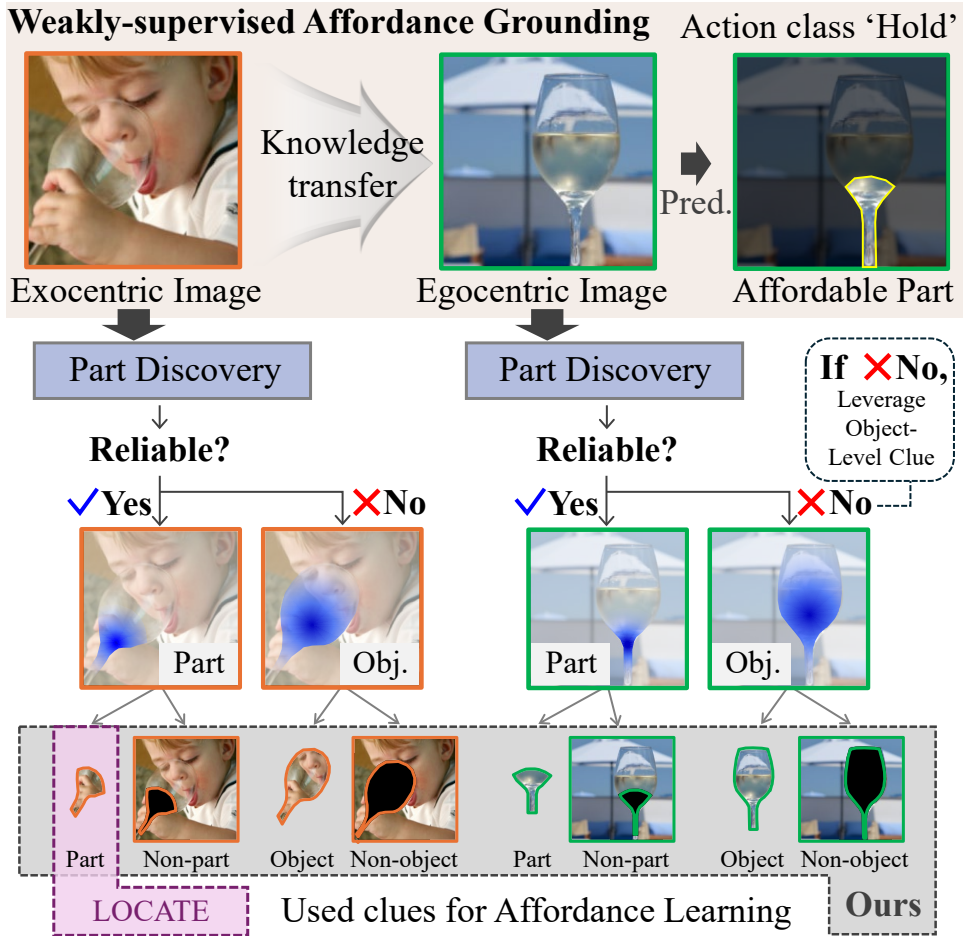
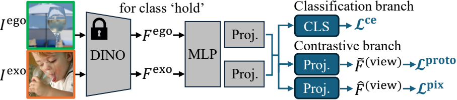
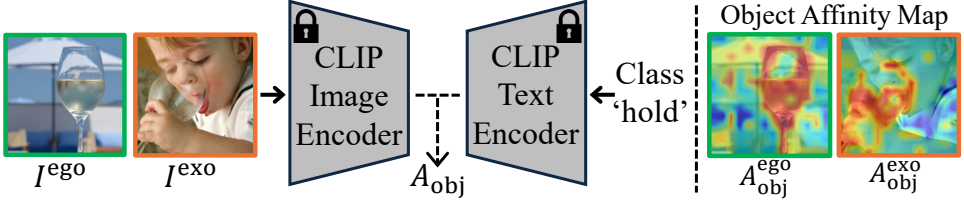
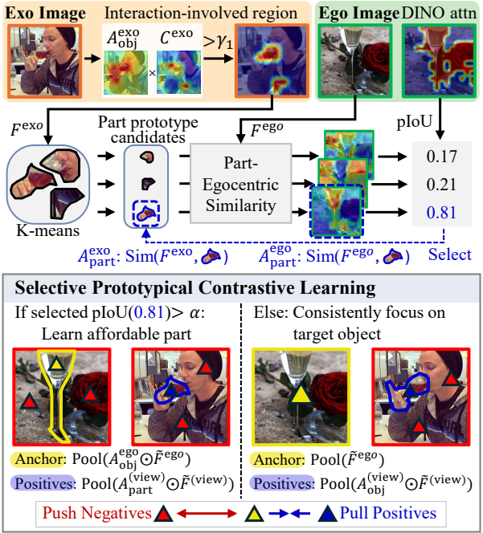
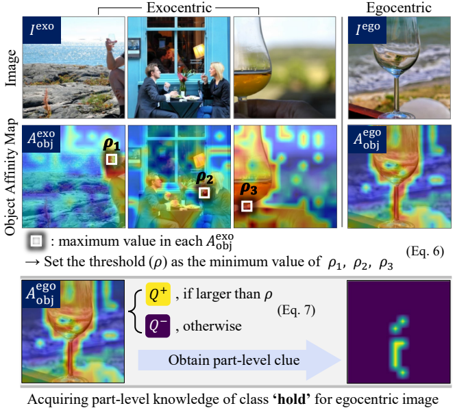
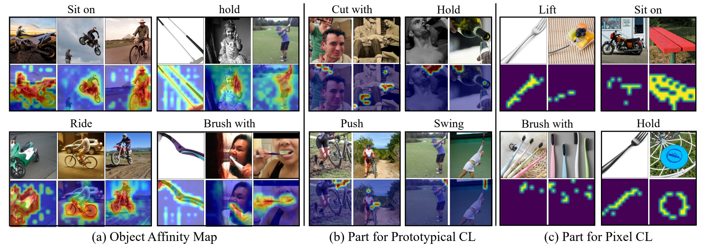
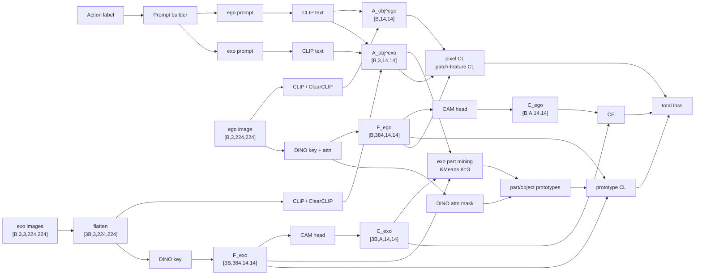
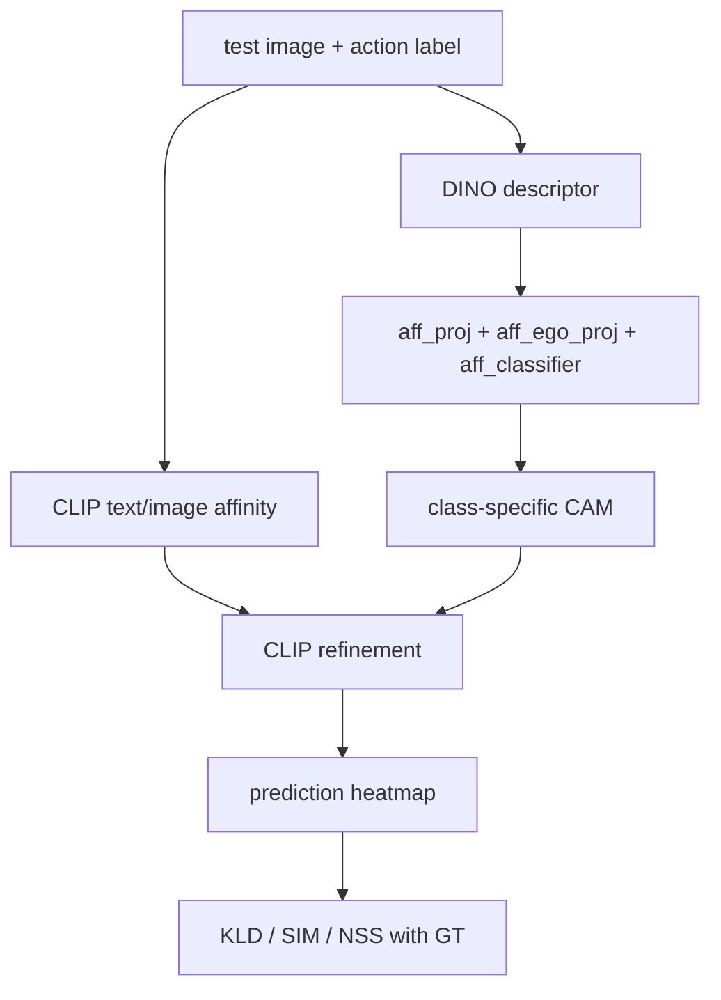

# SelectiveCL 한국어 분석: Train / Inference / Loss Flow

이 문서는 `/root/workspace/andycho/CV/SelectiveCL` repo를 기준으로 SelectiveCL의 학습 흐름, 추론 흐름, loss 계산에서 실제로 무엇과 무엇을 비교하는지 정리한다. 논문 표현을 그대로 옮기기보다, 코드에서 실제 tensor가 어떻게 흐르는지에 초점을 둔다.

## 1. 한 줄 요약

SelectiveCL은 dense GT heatmap 없이 학습한다. 학습 loss는 image-level affordance label, CLIP object affinity, DINO patch feature/attention으로 만든 pseudo clue를 사용한다. GT mask는 학습 loss에는 들어가지 않고, epoch 끝 evaluation과 최종 test metric 계산에만 사용된다.

```text
train loss:
  GT mask 사용 안 함
  image-level label + CLIP/DINO pseudo clue 사용

metric/evaluation:
  prediction heatmap vs GT mask
  KLD / SIM / NSS 계산
```

## 2. 내가 봤을 때 핵심 코드

가장 핵심은 `models/locate.py`의 `Net.forward()`다. 논문 방법론의 거의 모든 train-time 동작이 이 함수에 모여 있다.

| 중요도 | 파일 / 함수 | 역할 |
| --- | --- | --- |
| 1 | `models/locate.py::Net.forward` | train-time 핵심. CLIP affinity, DINO descriptor, KMeans part mining, CAM logits, contrastive loss 입력을 모두 만든다. |
| 2 | `loss/loss.py::ContrastiveLoss` | selective prototypical contrastive learning 구현. ego anchor와 ego/exo prototype을 비교한다. |
| 3 | `loss/loss.py::PixelContrastiveLoss` | pixel contrastive learning 구현. 실제 비교 단위는 raw pixel이 아니라 14x14 patch feature다. |
| 4 | `models/locate.py::Net.test_forward` | inference 핵심. ego image만 사용해서 CAM과 CLIP-refined heatmap을 만든다. |
| 5 | `data/datatrain.py::TrainData.__getitem__` | train sample을 exo 3장 + ego 1장 + affordance label로 구성한다. |
| 6 | `train.py` | dataloader, optimizer, loss sum, epoch-end evaluation, checkpoint save를 담당한다. |
| 7 | `test.py` | checkpoint 로드, inference, KLD/SIM/NSS, optional visualization을 담당한다. |

전체 의존 관계는 이렇게 볼 수 있다.

```text
data/datatrain.py
  -> train.py
    -> models/locate.py::Net.forward
      -> CLIP / DINO feature extraction
      -> KMeans part mining
      -> loss/loss.py::{ContrastiveLoss, PixelContrastiveLoss}
    -> epoch-end models/locate.py::Net.test_forward
    -> utils/evaluation.py metrics with GT masks

 test.py
  -> data/datatest.py
  -> models/locate.py::Net.test_forward
  -> utils/evaluation.py metrics with GT masks
```

## 3. 논문 Figure로 보는 구조

아래 그림들은 `arXiv-2508.07877v1.tar.gz`에서 추출해 `assets/paper_figures/`에 렌더링한 것이다.

### 3.1 Selective Learning Intuition



핵심 아이디어는 part-level clue가 reliable하면 part를 학습하고, reliable하지 않으면 object-level clue로 fallback한다는 것이다. 즉 항상 part만 강제하지 않고, 상황에 따라 object-level과 part-level supervision을 선택한다.

### 3.2 Overall Framework



코드 대응:

| 논문 block | 코드 대응 |
| --- | --- |
| DINO feature | `vit_model.get_last_key` |
| CLIP object affinity | `get_clip_affinity_map`, `get_clip_affinity_map_ego` |
| CAM branch | `aff_proj -> aff_ego_proj/aff_exo_proj -> aff_classifier` |
| prototypical CL branch | `K_contrast_projection`, `ContrastiveLoss` |
| pixel CL branch | `pixel_contrast_projection`, `PixelContrastiveLoss` |

### 3.3 CLIP Object Discovery



CLIP/ClearCLIP은 image patch feature와 action text feature의 similarity로 object affinity map을 만든다.

Egocentric prompt:

```text
an item to {action} with
```

Exocentric prompt는 action prompt와 entity prompt를 같이 사용한다.

```text
an item to {action} with
a person {action} an item
```

코드에서는 exocentric object affinity를 다음처럼 만든다.

```text
A_exo = local_mean(entity_prompt_similarity) * action_prompt_similarity
```

### 3.4 Selective Prototypical Contrastive Learning



Exocentric image에서 affordance/object 관련 patch feature를 모아 KMeans로 part prototype candidate를 만든다. 그 candidate가 egocentric DINO attention과 잘 맞으면 reliable part로 보고 part-level contrastive learning을 한다. 그렇지 않으면 object-level prototype으로 fallback한다.

### 3.5 Selective Pixel Contrastive Learning



Exocentric object affinity의 salient response를 기준값 `rho`로 삼아 egocentric patch 위치를 positive/negative로 나눈다. 이름은 pixel contrastive지만 구현상 실제 비교 단위는 14x14 patch-grid feature다.

### 3.6 Discovered Object / Part Examples



왼쪽은 CLIP object affinity, 가운데는 prototypical CL에 쓰이는 exocentric part clue, 오른쪽은 pixel CL에 쓰이는 egocentric positive clue에 해당한다.

## 4. 전체 구조도



## 5. Train 데이터 흐름

`TrainData`는 exocentric image path를 기준으로 sample을 만든다.

```text
{data_root}/{divide}/trainset/exocentric/{affordance}/{object}/{image}
```

각 sample 구성:

| 값 | shape | 의미 |
| --- | --- | --- |
| `exocentric_images` | `[3, 3, 224, 224]` | 같은 affordance/object 폴더의 exo image 3장 |
| `egocentric_image` | `[3, 224, 224]` | 같은 affordance/object 폴더의 ego image 1장 |
| `aff_label` | scalar | affordance class index |
| `aff_name` | string | affordance name |

Batch 후:

| 값 | shape |
| --- | --- |
| `exo` | `[B, 3, 3, 224, 224]` |
| `ego` | `[B, 3, 224, 224]` |
| `aff_label` | `[B]` |

`Net.forward()` 시작에서 exo는 flatten된다.

```text
[B,3,3,224,224] -> [3B,3,224,224]
```

## 6. Train에서 GT를 쓰는가?

Train loss 계산에는 GT mask/heatmap을 쓰지 않는다.

| Source | train loss 사용 여부 | 용도 |
| --- | --- | --- |
| image-level affordance label | yes | CE loss, contrastive class relation |
| ego image | yes | target CAM, anchor, patch feature |
| exo images | yes | part prototype discovery |
| CLIP object affinity | yes | pseudo object/part clue |
| DINO descriptor / attention | yes | feature prototype, reliable part selection |
| GT mask / heatmap | no | loss에는 사용하지 않음 |

다만 `train.py`는 epoch가 끝날 때 testset을 평가한다. 이때는 GT mask를 사용한다.

```text
mini-batch training:
  GT mask 사용 안 함
  loss 계산 및 backward

end-of-epoch evaluation:
  prediction heatmap vs GT mask
  KLD / SIM / NSS 계산
  best checkpoint 선택
```

즉 정확한 표현은 다음이다.

```text
training objective는 dense GT 없이 학습된다.
training script는 validation metric 계산을 위해 epoch 끝에 GT mask를 읽는다.
```

## 7. CLIP / DINO feature shape

### 7.1 CLIP patch feature

CLIP image encoder는 `224x224` 이미지를 `14x14` patch token으로 본다.

| 값 | shape |
| --- | --- |
| `ego_image_features` | `[B,196,512]` |
| `exo_image_features` | `[3B,196,512]` |
| `text_features` | `[B,512]` |

Egocentric object affinity:

```math
A^{ego}_{obj}(p) = cosine(f^{ego}_{clip}(p), t_{action})
```

Exocentric object affinity:

```math
A^{exo}_{obj} = local\_mean(A^{exo}_{entity}) \odot A^{exo}_{action}
```

### 7.2 DINO patch descriptor

DINO ViT-S/16:

```text
patch size = 16
224 / 16 = 14
14 x 14 = 196 patch tokens
CLS 포함 token 수 = 197
feature dim = 384
num heads = 6
head dim = 64
```

Raw key:

| 값 | shape |
| --- | --- |
| `ego_key` | `[B,6,197,64]` |
| `exo_key` | `[3B,6,197,64]` |

Code reshape:

```text
[B,6,197,64]
-> permute [B,197,64,6]
-> flatten [B,197,384]
-> drop CLS [B,196,384]
-> reshape [B,384,14,14]
```

## 8. KMeans는 pixel prototype인가 feature prototype인가?

KMeans로 얻는 것은 **feature-level prototype**이다. raw RGB pixel이나 coordinate를 clustering하는 게 아니다.

실제 KMeans input:

```text
exo DINO descriptor map: [3B,384,14,14]
CLIP/CAM mask가 높은 patch만 선택
selected exo features: [num_selected_patches,384]
```

KMeans output:

```text
K=3 centroids
centroids: [3,384]
```

정리:

```text
pixel-level prototype X
patch-feature-level part prototype O
```

논문에서 `part prototype`이라고 부르는 이유는 이 feature centroid가 object part에 해당하는 patch 위치들에서 만들어졌기 때문이다. 하지만 prototype 자체는 384차원 DINO feature vector다.

## 9. Part-Egocentric Similarity 계산

Part-Egocentric Similarity는 exo에서 얻은 KMeans centroid가 ego image의 각 patch feature와 얼마나 비슷한지 계산한 map이다.

Code 흐름:

```python
# exo에서 선택된 DINO descriptor
exo_aff_desc: [num_selected_patches, 384]

# KMeans
clu_cens: [3, 384]

# ego DINO descriptor에 CLIP ego affinity를 곱함
ego_desc: [B,384,14,14]
CLIP_ego_similarity: [B,14,14]
ego_desc_flat = (ego_desc * CLIP_ego_similarity.unsqueeze(1)).flatten(-2, -1)
# ego_desc_flat[b]: [384,196]

# centroid와 ego patch feature 비교
sim_map = torch.mm(clu_cens, normalize(ego_desc_flat[b], dim=0))
# [3,384] x [384,196] = [3,196]
# -> [3,14,14]
```

수식:

```math
S_k(p) = \left< \hat c_k, \widehat{A^{ego}_{obj}(p)F^{ego}(p)} \right>
```

| 기호 | 의미 |
| --- | --- |
| `c_k` | exo DINO feature에서 얻은 k번째 KMeans centroid |
| `F^{ego}(p)` | ego image의 p번째 DINO patch feature |
| `A^{ego}_{obj}(p)` | ego patch p의 CLIP object affinity |
| `S_k(p)` | part prototype k와 ego patch p의 similarity |

이 map을 DINO self-attention hard mask와 비교해서 pIoU-like score를 만들고, 가장 score가 높은 centroid가 `alpha` 이상이면 reliable part로 선택한다.

```text
part-egocentric similarity map
vs
DINO ego self-attention hard mask
-> pIoU-like score
-> best centroid 선택
```

## 10. Pixel feature가 정확히 무엇인가?

여기서 `pixel feature`는 raw RGB pixel이 아니다. 구현에서는 `14x14` patch-grid의 각 위치에 대응하는 feature vector다.

| 이름 | shape | 사용처 |
| --- | --- | --- |
| CLIP patch feature | `[B,196,512]` | image-text similarity로 object affinity 생성 |
| DINO patch descriptor | `[B,384,14,14]` | KMeans part prototype, part-egocentric similarity |
| pixel contrast feature | `[B,384,14,14]` | `PixelContrastiveLoss`에서 실제 비교되는 feature |

`PixelContrastiveLoss`에서 비교되는 feature는 이 tensor다.

```python
ego_pred_cont_pixel = self.pixel_contrast_projection(ego_proj_nocond)
```

Shape:

```text
[B,384,14,14]
-> per image [196,384]
```

즉 pixel contrastive는 실제로 다음 비교다.

```text
ego patch-feature at location p
vs
ego patch-feature at location q
```

아니다:

```text
RGB pixel p
vs
RGB pixel q
```

## 11. 학습 때 무엇과 무엇을 비교하는가?

### 11.1 CE loss

비교 대상:

```text
predicted affordance class logits
vs
image-level affordance label
```

Ego:

```text
ego CAM [B,A,14,14]
-> GAP
-> ego logits [B,A]
-> CE(logits, aff_label)
```

Exo:

```text
exo CAM [3B,A,14,14]
-> GAP
-> exo logits [B,3,A]
-> 각 exo image마다 CE(logits, aff_label)
```

### 11.2 Prototypical Contrastive Loss

비교 대상:

```text
ego anchor feature
vs
ego/exo object-or-part prototypes
```

Positive:

```text
same affordance class의 positive prototype
```

Negative / denominator side:

```text
same affordance class의 background prototype
other affordance class의 positive prototype
```

직관:

```text
ego image의 hold anchor
-> hold에 해당하는 ego/exo part 또는 object prototype과 가까워짐
-> 다른 action prototype이나 background prototype과 구분됨
```

### 11.3 Pixel Contrastive Loss

비교 대상:

```text
ego image 내부의 patch feature
vs
ego image 내부의 patch feature
```

CLIP object affinity로 patch 위치를 나눈다.

```text
Q+ = affordance/object-positive patch 후보
Q- = 나머지 patch 후보
```

목표:

```text
Q+ patch feature끼리는 가까워지게
Q+ patch feature와 Q- patch feature는 구분되게
```

다시 강조하면, 여기서도 raw pixel이 아니라 patch-feature-level 비교다.

## 12. Inference 흐름

Inference는 train보다 훨씬 짧다. exocentric image, KMeans, contrastive loss가 없다.



`test_forward()` output:

| output | shape | 의미 |
| --- | --- | --- |
| `ego_map_pred` | `[B,14,14]` | raw class-specific CAM |
| `refined_CLIP_ego_ego` | `[B,14,14]` | CLIP affinity * CAM |
| `refined_CLIP_ego_mean` | `[B,14,14]` | CLIP affinity * local-mean CAM |

논문은 inference calibration을 `binarized object affinity * CAM`으로 설명한다. 현재 repo 코드는 raw `CLIP_ego_similarity * CAM`을 사용한다. 분석할 때는 이 차이를 구분해야 한다.

## 13. Metric 설명

Metric은 train loss가 아니다. Epoch-end evaluation과 `test.py`에서 prediction heatmap과 GT mask/heatmap을 비교할 때 사용한다.

### 13.1 KLD

Kullback-Leibler Divergence. Prediction과 GT를 확률분포처럼 normalize한 뒤 분포 차이를 계산한다.

```text
낮을수록 좋음
```

수식:

```math
P(x)=\frac{pred(x)}{\sum_x pred(x)+\epsilon}
```

```math
G(x)=\frac{GT(x)}{\sum_x GT(x)+\epsilon}
```

```math
KLD(G||P)=\sum_x G(x)\log\left(\frac{G(x)}{P(x)+\epsilon}+\epsilon\right)
```

직관:

```text
GT가 높은 위치에 prediction도 높으면 KLD가 낮다.
GT와 prediction 위치가 다르면 KLD가 커진다.
```

### 13.2 SIM

Similarity. Normalized prediction과 normalized GT의 겹치는 질량을 본다.

```text
높을수록 좋음
보통 0~1 범위
```

수식:

```math
SIM(P,G)=\sum_x \min(P(x),G(x))
```

직관:

```text
prediction heatmap과 GT heatmap의 공통 면적
```

### 13.3 NSS

Normalized Scanpath Saliency. Prediction map을 평균 0, 표준편차 1로 normalize한 뒤 GT-positive 위치에서 prediction 값이 평균보다 얼마나 높은지 본다.

```text
높을수록 좋음
0이면 평균 수준
양수면 GT 위치에서 prediction이 평균보다 높음
```

수식:

```math
Z(x)=\frac{pred(x)-\mu(pred)}{\sigma(pred)}
```

```math
NSS=\frac{1}{|F|}\sum_{x\in F}Z(x)
```

`F`는 GT-positive/fixation 위치다. Repo 구현에서는 GT를 normalize한 뒤 threshold `0.1`로 binary fixation map을 만든다.

요약:

| Metric | Good direction | 의미 |
| --- | --- | --- |
| KLD | 낮을수록 좋음 | GT와 prediction 분포 차이 |
| SIM | 높을수록 좋음 | GT와 prediction 겹침 |
| NSS | 높을수록 좋음 | GT positive 위치에서 prediction saliency가 얼마나 높은가 |

## 14. 최종 요약

```text
핵심 코드:
  models/locate.py::Net.forward

학습 supervision:
  image-level label + CLIP/DINO pseudo clue
  dense GT mask는 train loss에 사용하지 않음

KMeans prototype:
  raw pixel prototype이 아니라 exo DINO patch feature의 384-d centroid

Part-Egocentric Similarity:
  exo centroid와 ego DINO patch feature 간 cosine similarity map

Pixel contrastive:
  이름은 pixel이지만 구현상 14x14 patch-feature-level contrast

Inference:
  ego image + action label만 사용
  CAM 생성 후 CLIP affinity로 refinement

Metrics:
  KLD/SIM/NSS는 prediction heatmap과 GT mask를 비교하는 evaluation metric
```
